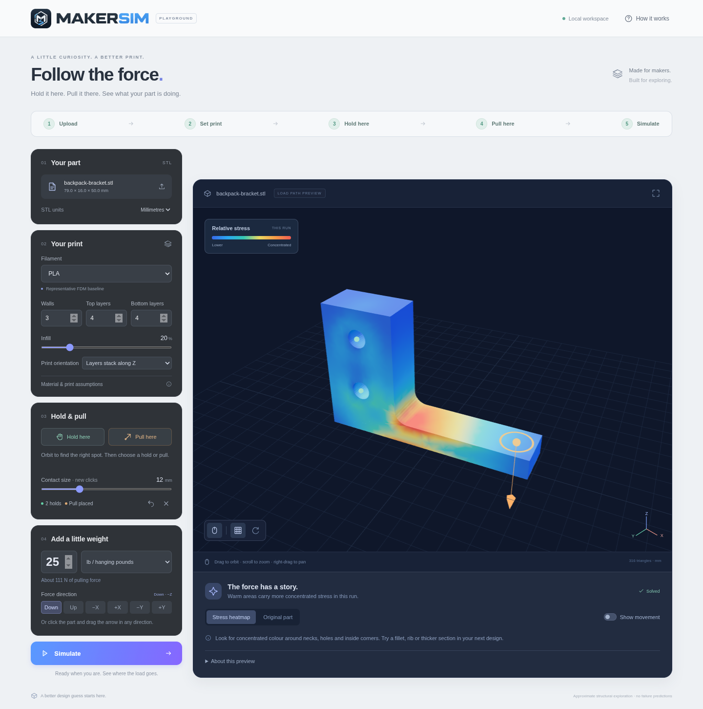
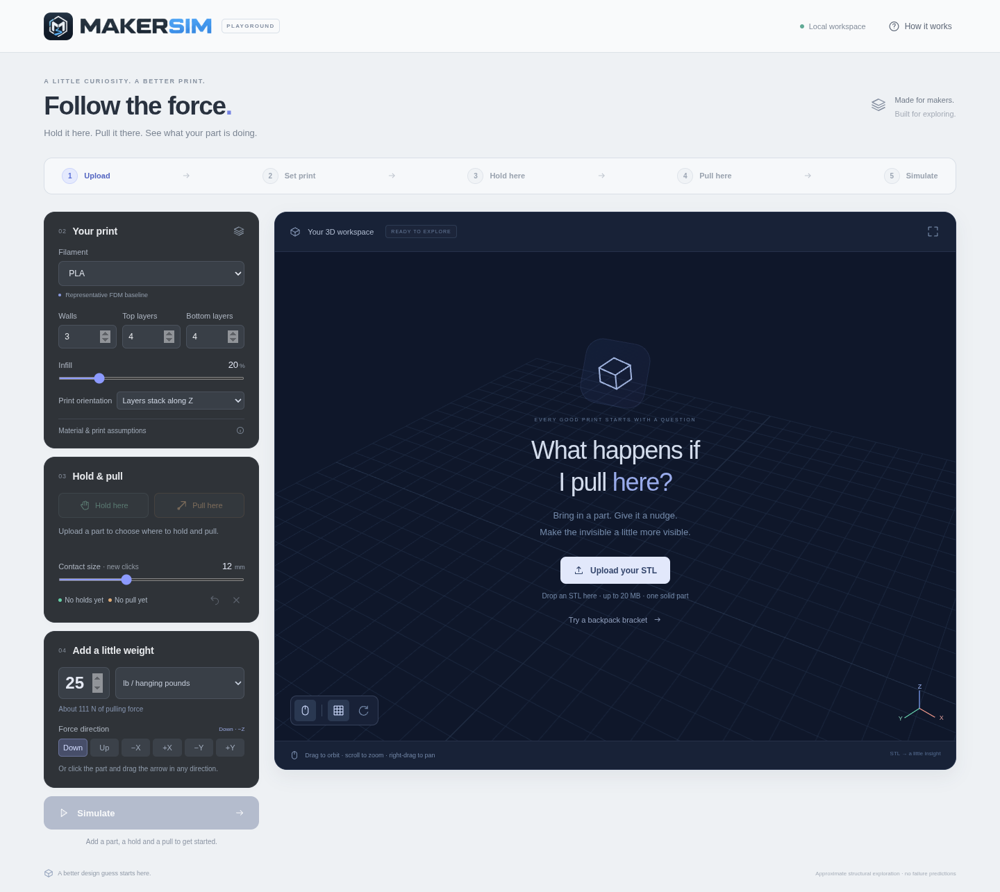
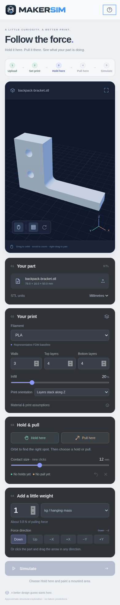

<p align="center">
  
</p>

<h1 align="center">MakerSim</h1>
<p align="center"><strong>Follow the force.</strong><br>Design · Analyze · Make</p>

<p align="center">
  
  
  
  
</p>

MakerSim helps makers explore how a force travels through a 3D-printed part.
Upload an STL, choose your filament and print settings, paint the surfaces held
still, and place a pull. A local elasticity solver returns a relative stress
heatmap and an optional exaggerated movement preview.

**Version 0.1.0 is an early playground checkpoint.** STL viewing, painted holds,
distributed loads, print-property assumptions, and simulation are implemented.
Results support design exploration; they do not predict failure or establish
safe working loads. See [physics and limits](#physics-and-limits).

## Quick start

From an installed checkout:

```bash
./scripts/start.sh
```

Open the local URL printed by the launcher. It tries **http://127.0.0.1:8000**,
then ports 8001–8010 if occupied, and finally an available system-assigned port.
To choose a port, run `./scripts/start.sh 8001`. Keep the terminal open while
working; press `Ctrl+C` to stop the app.

1. Choose **Try a backpack bracket** for a ready-to-run example, or **Upload your
   STL** in the center of the 3D workspace. After upload, file details, units, and
   replacement controls appear under **Your part** on the left.
2. Set your filament, walls, top/bottom layers, infill, and print orientation.
3. Choose **Hold here** and click or paint mounted surfaces. Choose **Pull here**
   and click a load surface, then drag the arrow or select a direction preset.
4. Set the weight or force and choose **Simulate**. Explore the heatmap, switch
   back to the original part, or enable **Show movement**.

The included bracket starts with two mounting-hole patches held still and a
25 lb downward pull. Clear its selections to try your own setup. Use **Orbit**
to reach another side. Direction presets use the STL's axes, with Z up; the
contact-size slider applies to new clicks.

## Installation

The source launcher uses Bash, Python 3.11+, Node.js 20.19+, npm, and
[uv](https://docs.astral.sh/uv/). A browser with WebGL is required for the viewer.

```bash
git clone https://github.com/RawLabs/MakerSim.git
cd MakerSim
uv sync
./scripts/start.sh
```

The launcher installs Python dependencies with `uv` when needed, installs the
frontend dependencies when absent, builds the frontend, and serves the workspace
and solver from one local Python process. Existing services on other ports are
left running. The source launcher is intended for Linux and other environments
with Bash; a native Windows launcher is not included.

MakerSim runs on `127.0.0.1`. Uploaded parts stay in the local process rather than
being sent to an external service. The workspace retains at most six models;
models expire after two hours and disappear when the process stops. Dependencies
need internet access for their initial installation; Three.js is bundled locally.

## Demo screens

Captured from the actual application with the real local solver. The example
geometry and loading are a demonstration, not a validated bracket design.

### Load-path preview



Warm colors identify concentrated stress within this run. Colors rescale with
each simulation and are not a failure scale.

<details>
<summary>Start a new part — center upload prompt</summary>



</details>

<details>
<summary>Mobile workspace</summary>

<p align="center">
  
</p>

</details>

[Quick start](#quick-start) · [Physics and limits](#physics-and-limits) ·
[Verification](#verification) · [Logo and brand sheet](artifacts/MakerSimLogos.png)

## Current playground workflows

| In the workspace | What MakerSim helps you do |
| --- | --- |
| **Your part** | Load binary or ASCII STLs, check dimensions and units, and replace the part. |
| **Your print** | Choose filament, walls, solid layers, infill, and the build axis. |
| **Hold & pull** | Paint several held areas and place a distributed load patch with a draggable arrow. |
| **Add a little weight** | Use newtons, pounds-force, kilograms of hanging mass, or stone of hanging mass. |
| **Simulate** | Explore relative stress on the original STL and optionally display exaggerated movement. |

The viewer supports orbit, zoom, pan, camera fit, grid visibility, and optional
slow rotation. Changing material, print settings, holds, direction, or load clears
the previous result so the displayed preview matches the current setup.

STLs do not declare their units. MakerSim defaults to millimetres; choose inches
when appropriate and check the displayed dimensions. Files can contain up to
20 MB and 120,000 triangles. Open surfaces can be viewed but must be repaired
before solving. Simulation requires one connected, closed solid.

## Physics and limits

The solver classifies the closed STL with triangle scanlines, builds a bounded
voxel volume of up to 4,800 cells, and divides each cell into six conforming
linear tetrahedra. If coarse sampling splits a connected part or misses its
thickness, meshing retries with smaller cells within the same budget. Actual
separate solids remain rejected; meshing does not fill gaps or discard pieces.

The model assembles a three-dimensional orthotropic elasticity matrix in
**mm, N, MPa** and solves free degrees of freedom with SciPy. Held patches
constrain all three translations. Load clicks expand to at least a mesh-cell
surface patch and distribute the total force over several surface nodes.
Overlapping holds/loads, floating pieces, incomplete rigid-body constraints,
and excessive equilibrium residuals produce actionable errors.

Surface stress is a volume-weighted nodal von Mises scalar used to visualize
concentration, not an anisotropic failure criterion. The frontend interpolates
the field onto a subdivided version of the original STL. Each run rescales
colors using its 98th percentile, so colors alone cannot compare load magnitudes
across runs. Movement has an explicit exaggeration factor.

### Mesh approximation

This is a staircase volume approximation rather than a boundary-conforming
tetrahedral mesh. Features smaller than roughly two cells can disappear; small
bolt holes and thin walls need particular care. There is no mesh-convergence
guarantee, and first-order tetrahedra can be overly stiff in bending. Selected
contact areas also approximate the coarse volume. A part whose connections
cannot be resolved within the mesh budget needs thicker features or simpler
geometry for this preview.

### Print assumptions

Print settings use a heuristic effective solid fraction from walls, solid layers,
and infill. V1 assumes 0.45 mm extrusion width, 0.20 mm layers, and balanced
in-plane rasters. A symmetric positive definite compliance model uses separate
XY/Z moduli and in-plane shear stiffness; build-axis shear is estimated.

The build direction can be X, Y, or Z. Arbitrary rotations, explicit rasters,
individual strands, slicer toolpaths, and delamination are not modeled. Flexible
materials and large movements are especially approximate. There are no failure
predictions, certified loads, yield/plasticity, contact, buckling, impact, or
large-deformation analysis.

## Material sources and provenance

[`backend/data/materials.json`](backend/data/materials.json) and
[`makersim_filament_master.csv`](backend/data/makersim_filament_master.csv) are
preserved from the T7 MakerSim archive without importing its architecture.
[`backend/materials.py`](backend/materials.py) maps catalog entries into a small
physics schema with explicit XY/Z Young’s modulus, XY shear modulus, Poisson
ratio, density, and optional directional strengths. The solver uses stiffness,
not strength thresholds.

The 12 generic FDM baselines in
[`fdm_baselines.json`](backend/data/fdm_baselines.json) are adapted from
[ichris97/multimaterial-3d-printing](https://github.com/ichris97/multimaterial-3d-printing/blob/master/src/multimaterial_3d/core/materials.py),
file SHA `91a9e899c542041058a8ba835b2256e969720563`. They represent well-tuned,
solid prints rather than verified product measurements. The upstream MIT notice
is retained in [`BASELINE_LICENSE`](backend/data/BASELINE_LICENSE). Its CLT,
post-processing, failure estimates, and geometry-only stress maps are not imported.
Raster and geometry-precheck ideas remain deferred.

Unsupported archive entries remain visible but cannot be simulated when usable
stiffness is absent or continuous reinforcement exceeds this model. Missing Z
stiffness and shear are labeled assumptions; missing tensile strength is not
manufactured. Archived values have not been reverified against current datasheets.
Future measurements should override individual fields with their source and
print conditions.

External catalogs and printed-test corrections are separate future inputs.
References include [Open Filament Database](https://api.openfilamentdatabase.org/),
[OpenPrintTag](https://github.com/OpenPrintTag/openprinttag-database),
[FilamentCat](https://filamentcat.com/en), and
[3DPIceland](https://www.iskort.is/3dp/). V1 does not automatically ingest them:
identity matching, permitted reuse, units, test conditions, and field provenance
need a deliberate adapter.

## Development

Run the backend with reload enabled:

```bash
uv sync
.venv/bin/python -m uvicorn backend.app:app --reload --host 127.0.0.1 --port 8000
```

In another terminal, run the Vite frontend:

```bash
cd frontend
npm install
npm run dev
```

The frontend opens at **http://127.0.0.1:5173** and proxies `/api` to Python.

| Path | Contents |
| --- | --- |
| `backend/` | Local API, STL parsing, material adapter, and elasticity solver. |
| `backend/data/` | Example STL, archived materials, generic baselines, and their license. |
| `frontend/` | Vite workspace, UI, viewer, and bundled Three.js. |
| `scripts/` | Launcher, checks, example generation, and browser QA transport. |
| `tests/` | Solver, API, launcher, and viewer interaction checks. |
| `artifacts/` | Supplied brand sheet and application screenshots. |

## Verification

From the repository root:

```bash
./scripts/check.sh
```

This runs the Python suite, real Three.js interaction checks integrated with
solver output, and the production build. The current checkpoint passes 31 Python
tests, including affine tetrahedral strain, an analytical axial bar, equilibrium,
doubled-load scaling, orientation, print settings, retained holes, patch spreading,
thin-feature refinement, mesh-budget limits, and invalid inputs.

In-process HTTP tests run worker functions inline because the restricted build
environment blocks cross-thread wakeup sockets; those tests do not verify worker
concurrency. The Node interaction checks exercise actual geometry and raycasting
without WebGL.

For browser verification with Playwright and Chromium installed:

```bash
MAKERSIM_CHROMIUM=/usr/bin/chromium node scripts/browser-smoke.mjs
```

`MAKERSIM_PLAYWRIGHT_MODULE` can point to an existing Playwright module. The
harness serves built files through browser request interception and connects to
the real API in-process. It checks center upload, left-side replacement, painted
holds, arrow dragging, solving, reruns, unit conversion, help, movement, and mobile
layout. Full WebGL browser checks pass. Chromium needs socket access and may need
to run outside a restrictive sandbox. This intercepted harness does not verify
a live localhost deployment.

## License and third-party notices

A project-wide license for MakerSim has not yet been selected. The supplied
logo and artwork are not granted a separate reuse license by this repository.

Bundled third-party components retain their own licenses:

- Three.js r180 is vendored from the
  [official Three.js repository](https://github.com/mrdoob/three.js/tree/r180),
  with its [MIT license](frontend/src/vendor/LICENSE) retained locally.
- The generic FDM baselines retain their upstream
  [MIT notice](backend/data/BASELINE_LICENSE).

The original [logo and brand sheet](artifacts/MakerSimLogos.png) is included
alongside the screenshots and supplies the application header artwork.
